# ChartSystem — 完整 UML 类图

> 生成日期：2026-06-16 | 基于 `src/` 下所有 `.h` 文件分析
>
> **查看方式：** VS Code 中按 `Ctrl+Shift+V` 打开 Markdown 预览，Mermaid 图表自动渲染。

---

## 一、基础结构体

### 1.1 ChartItem — 数据单元

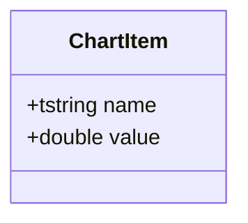

最基础的数据结构，存储一个数据项的名称和数值。所有图表类都使用 `vector<ChartItem>` 作为数据源。

### 1.2 ColorTheme — 颜色主题

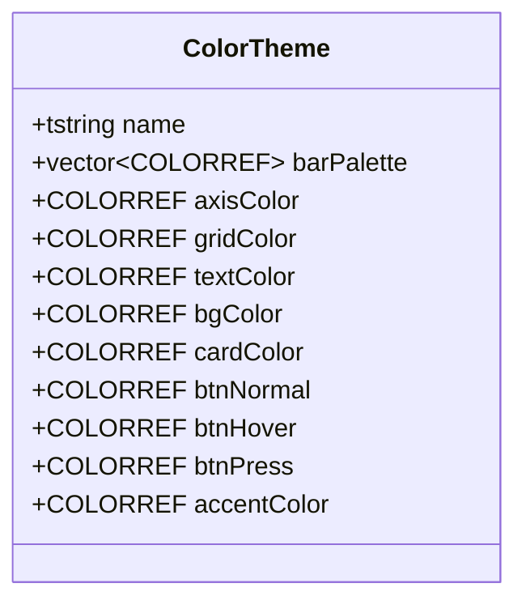

全局颜色配置，所有图表类和 UI 类都通过 `applyTheme(theme)` 接受一个 ColorTheme 引用。

### 1.3 ChartType — 图表类型枚举

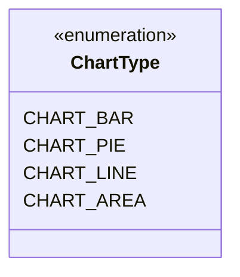

---

## 二、图表类体系（chart/）

### 2.1 Chart — 抽象基类

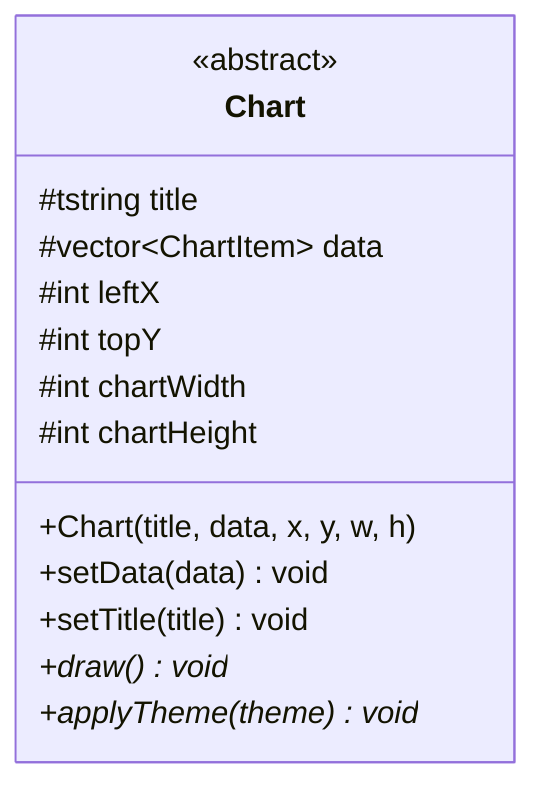

所有图表的抽象基类，定义了标题、数据、绘制区域等公共字段，子类必须实现 `draw()` 和 `applyTheme()`。

### 2.2 BarChart — 柱状图

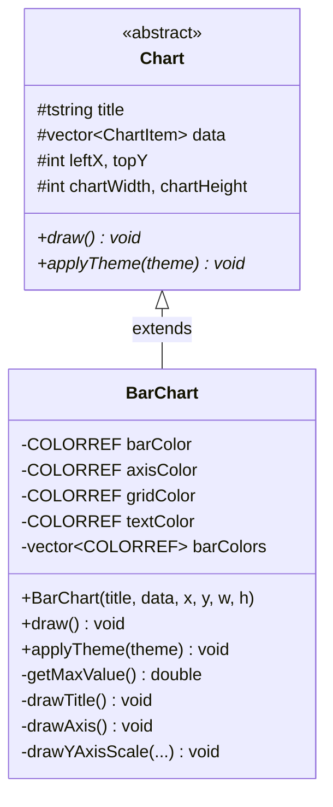

继承 `Chart`，用 EasyX 绘制柱状图。私有方法负责分步绘制坐标轴、刻度、柱体。

### 2.3 LineChart — 折线图

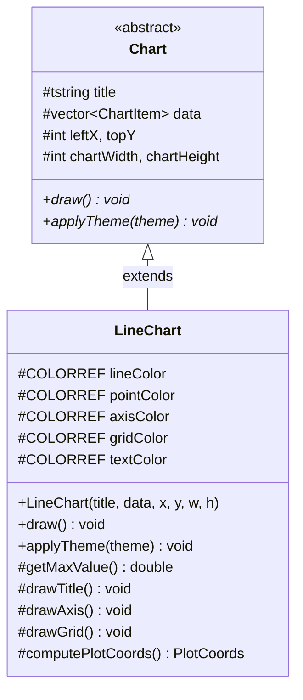

继承 `Chart`，protected 成员供子类 `AreaChart` 复用。内部定义了 `PlotCoords` 结构体存储坐标计算结果。

### 2.4 AreaChart — 面积图

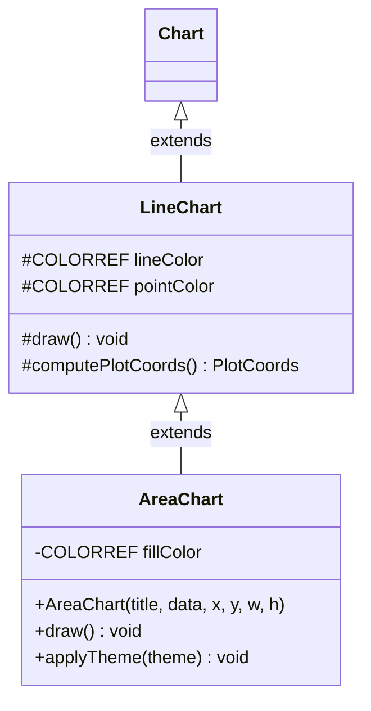

继承 `LineChart`（而非直接继承 `Chart`），复用折线图的坐标计算和网格绘制，仅增加填充色来绘制面积区域。

### 2.5 PieChart — 饼图

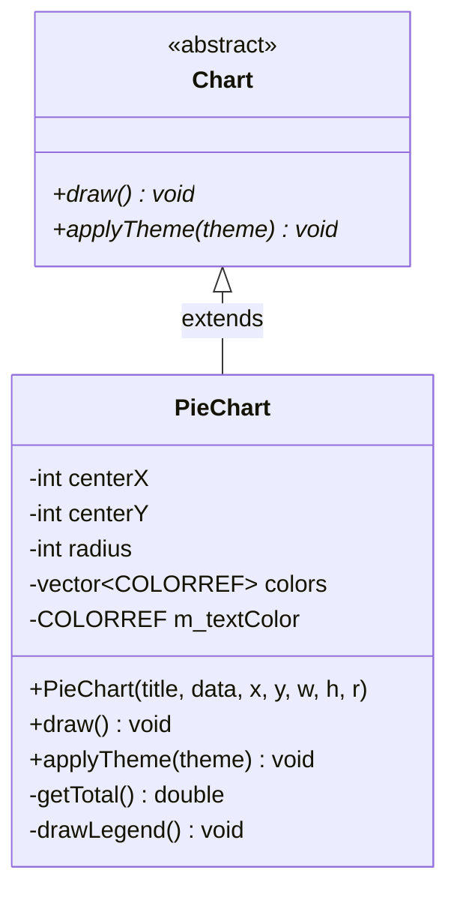

继承 `Chart`，额外接受 `radius` 参数控制饼图半径。

### 图表继承总览

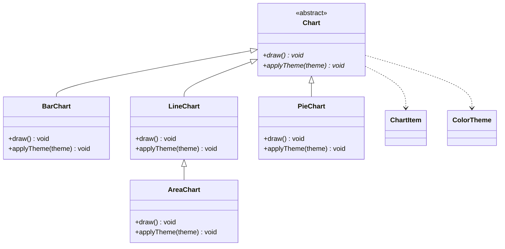

---

## 三、UI 类体系（ui/）

### 3.1 Button — 按钮

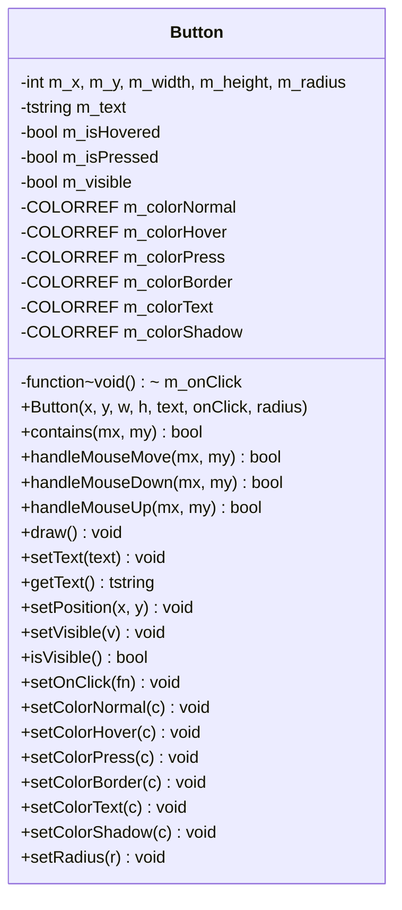

独立类，不继承任何基类。通过 `std::function<void()>` 存储点击回调。支持 hover/press 三态颜色。

### 3.2 Card — 圆角卡片基类

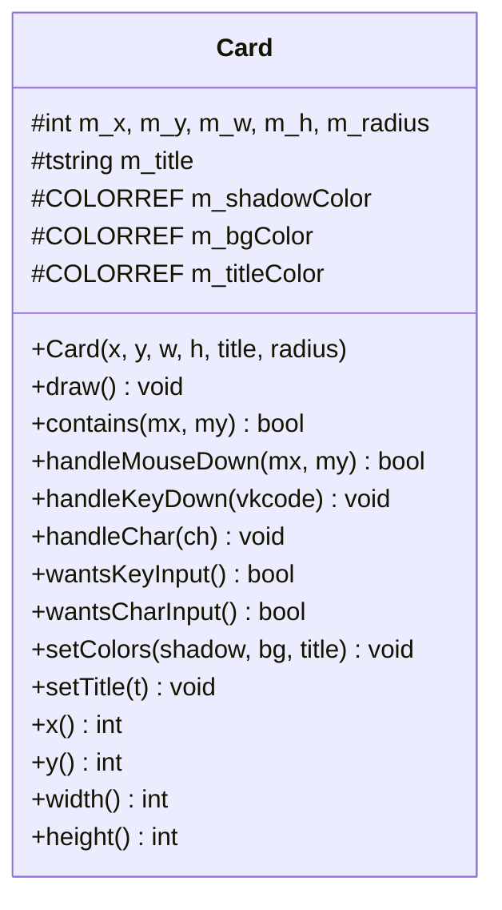

UI 基类，提供圆角背景框的通用绘制和边界检测。定义了键盘/字符输入的虚函数接口（默认空操作），供子类覆写。

### 3.3 DisplayBox — 只读文本展示框

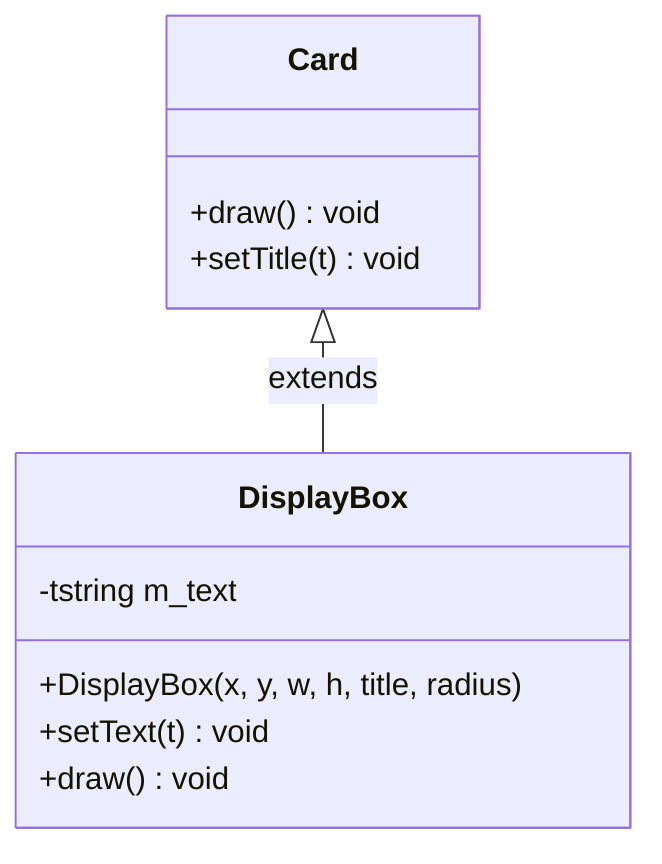

继承 Card，增加纯文本显示功能，不可编辑。

### 3.4 TextInput — 文本输入框

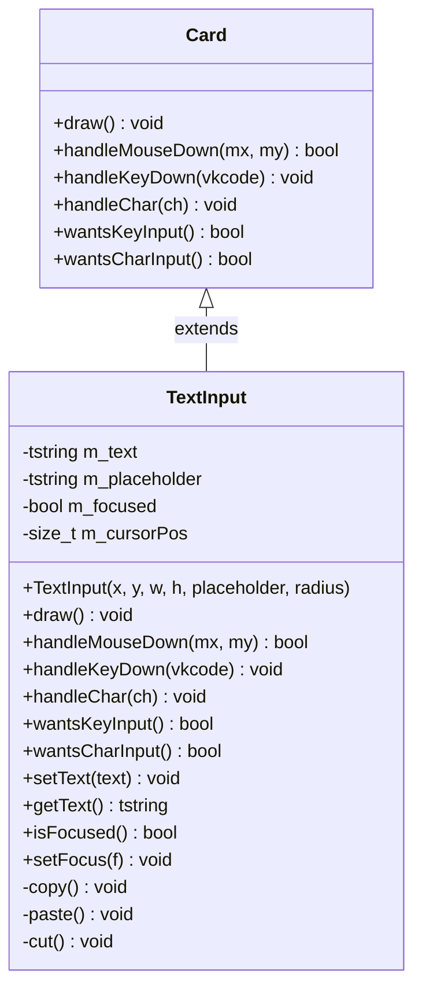

继承 Card，覆写所有输入相关虚函数。支持焦点管理、光标定位、剪贴板操作（copy/paste/cut）。

### 3.5 Page — 页面基类

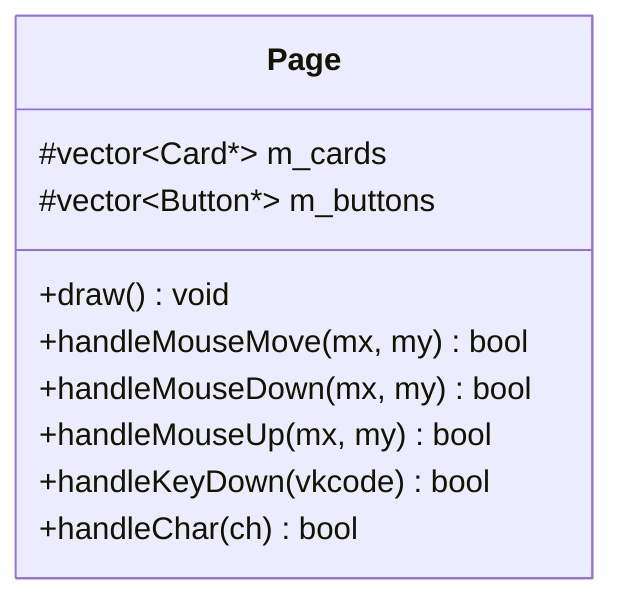

管理一组 Card 和 Button 指针，提供默认的事件分发实现（遍历所有子控件）。子类可以覆写 `draw()` 来增加自定义绘制。

### 3.6 MainPage — 主页面

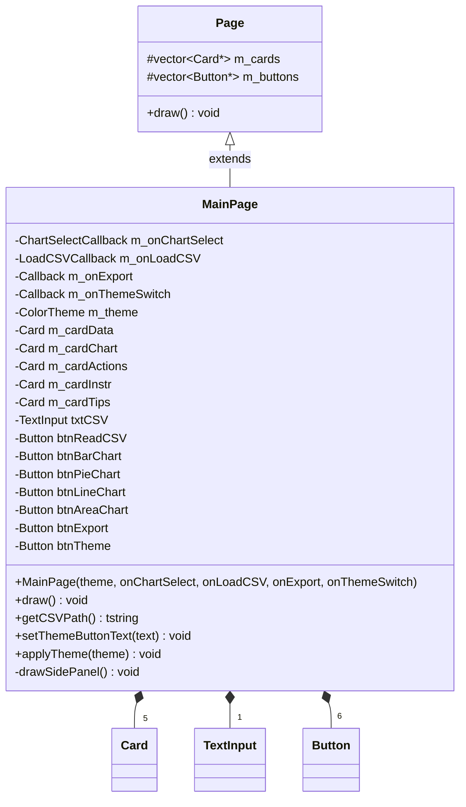

继承 Page，包含 **5 个 Card**（数据、图表、操作、说明、提示卡片）、**1 个 TextInput**（CSV 路径输入）、**6 个 Button**（读取 CSV、4 种图表选择、导出、主题切换）。通过 4 个 `std::function` 回调与外部交互。

### 3.7 ChartPage — 图表展示页面

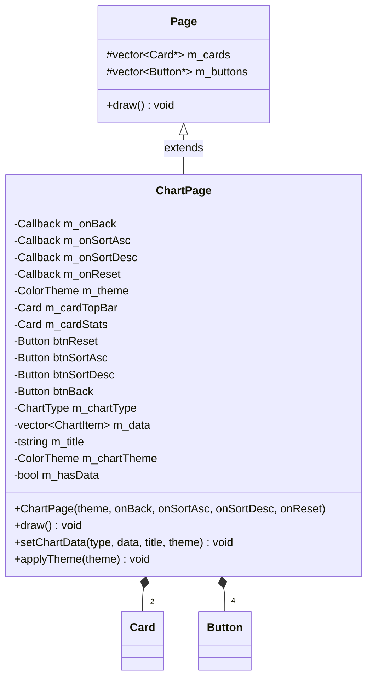

继承 Page，包含 **2 个 Card**（顶栏、统计卡片）、**4 个 Button**（返回、升序、降序、重置）。通过 `setChartData()` 接收图表数据并调用工厂函数 `createChart()` 动态创建图表对象进行绘制。

### UI 继承总览

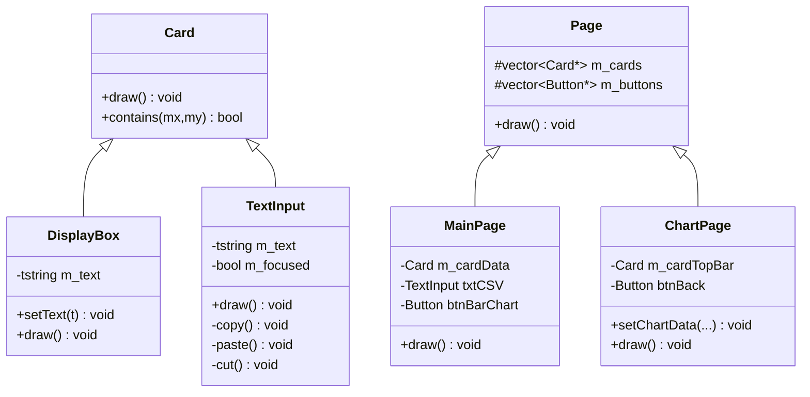

---

## 四、工具类（utils/）

### 4.1 DataAnalyzer — 数据分析器

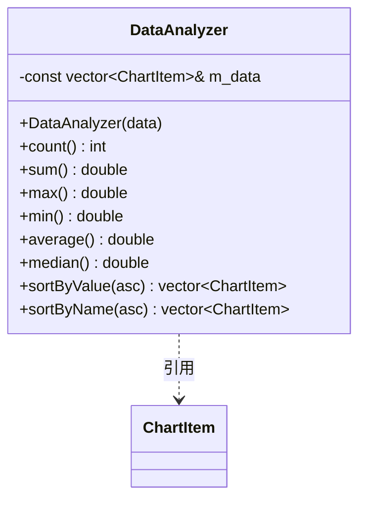

持有 `vector<ChartItem>` 的**常量引用**，提供统计计算（求和、最值、均值、中位数）和排序功能。所有方法都是 `const`，不修改原始数据，排序返回新数组。

### 4.2 FileDataReader — CSV 文件读取器

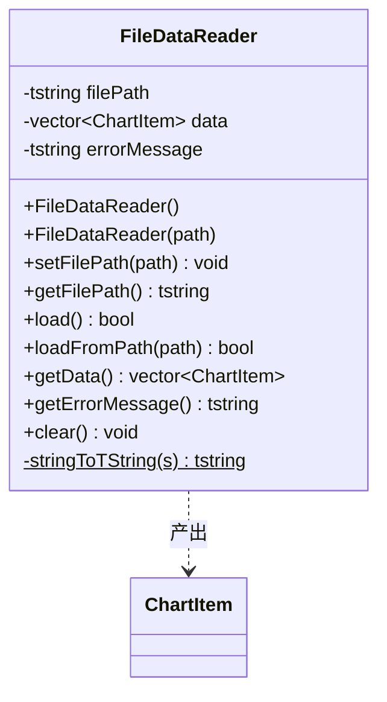

负责从 CSV 文件路径读取数据，解析为 `vector<ChartItem>`。支持 UNICODE 路径（通过 `tstring`）。错误时通过 `getErrorMessage()` 获取错误描述。

### 4.3 ImageExporter — 图片导出器

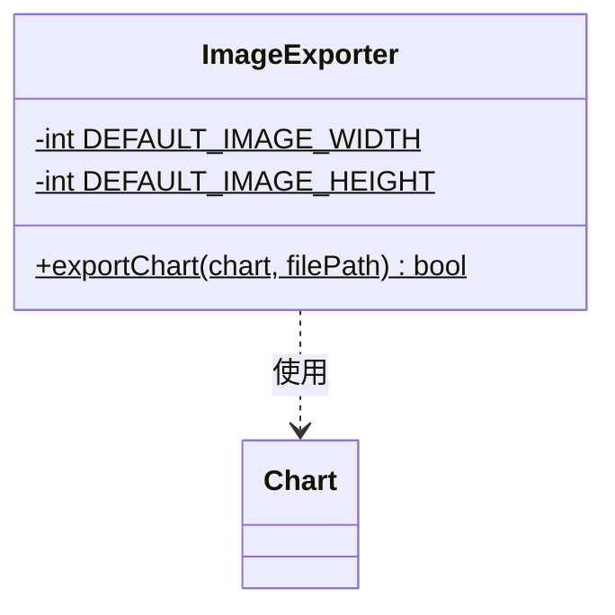

纯静态工具类。调用 `Chart::draw()` → EasyX `getimage()` → `saveimage()` 将图表保存为 PNG 文件。默认导出分辨率 1200×800。

---

## 五、全局函数（不属于任何类）

| 函数 | 所在文件 | 签名 |
|------|----------|------|
| `darkenColor` | chart/Chart.h | `COLORREF darkenColor(COLORREF c, int amount)` |
| `lightenColor` | chart/Chart.h | `COLORREF lightenColor(COLORREF c, int amount)` |
| `drawRoundRectFill` | utils/RenderUtils.h | `void drawRoundRectFill(int x, int y, int w, int h, int r, COLORREF color)` |
| `createChart` | ui/Pages.h | `unique_ptr<Chart> createChart(ChartType, title, data, theme)` |

- `darkenColor` / `lightenColor`：RGB 颜色变暗/变亮，所有图表类共享。
- `drawRoundRectFill`：用 EasyX 的 `solidrectangle` + `solidcircle` 组合绘制圆角矩形。
- `createChart`：工厂函数，根据 `ChartType` 枚举创建对应的图表对象。

---

## 六、全项目关系总览

```mermaid
classDiagram
    %% 继承
    Chart <|-- BarChart
    Chart <|-- LineChart
    Chart <|-- PieChart
    LineChart <|-- AreaChart
    Card <|-- DisplayBox
    Card <|-- TextInput
    Page <|-- MainPage
    Page <|-- ChartPage

    %% 组合
    Page o-- Card : 聚合
    Page o-- Button : 聚合

    %% 依赖
    Chart ..> ChartItem
    Chart ..> ColorTheme
    DataAnalyzer ..> ChartItem
    FileDataReader ..> ChartItem
    ImageExporter ..> Chart

    class Chart {
        <<abstract>>
        +draw()* void
        +applyTheme(theme)* void
    }
    class BarChart
    class LineChart
    class AreaChart
    class PieChart
    class Card {
        +draw() void
    }
    class DisplayBox
    class TextInput
    class Button {
        +draw() void
    }
    class Page {
        +draw() void
    }
    class MainPage
    class ChartPage
    class DataAnalyzer
    class FileDataReader
    class ImageExporter
```

---

## 七、总结表

| 类名 | 文件 | 父类 | 职责 |
|------|------|------|------|
| `ChartItem` | chart/Chart.h | — | 数据条目 (name + value) |
| `ColorTheme` | chart/Chart.h | — | 10 项颜色配置 |
| **`Chart`** | chart/Chart.h | — | 图表抽象基类 |
| `BarChart` | chart/BarChart.h | Chart | 柱状图 |
| `LineChart` | chart/LineChart.h | Chart | 折线图 + PlotCoords |
| `AreaChart` | chart/AreaChart.h | **LineChart** | 面积图（二级继承） |
| `PieChart` | chart/PieChart.h | Chart | 饼图 |
| `Button` | ui/Button.h | — | 三态按钮 + 回调 |
| **`Card`** | ui/Card.h | — | 圆角卡片基类 |
| `DisplayBox` | ui/Card.h | Card | 只读文本框 |
| `TextInput` | ui/TextInput.h | Card | 输入框 + 剪贴板 |
| **`Page`** | ui/Pages.h | — | 页面基类 |
| `MainPage` | ui/Pages.h | Page | 主页：导入/选择/导出 |
| `ChartPage` | ui/Pages.h | Page | 图表页：显示/排序 |
| `DataAnalyzer` | utils/DataAnalyzer.h | — | 统计分析 |
| `FileDataReader` | utils/FileDataReader.h | — | CSV 读取 |
| `ImageExporter` | utils/ImageExporter.h | — | PNG 导出 |
| `ChartType` | ui/Pages.h | — | 枚举：BAR/PIE/LINE/AREA |
